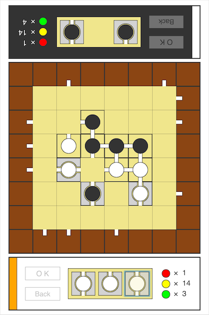

# Panelis

Chain block puzzle



## Features

- Place a tile on the game board to connect each other
- Make a score with path sequences and its color

## Running locally

- Install [Node](https://nodejs.org/en/download/)
- Install the dependencies

```
npm install
```

Then run:

```
npm start
```

Works on IE11, Firefox, Safari, Chrome.

## License

&copy; 2016 iOnStage
Licensed under the MIT License.
